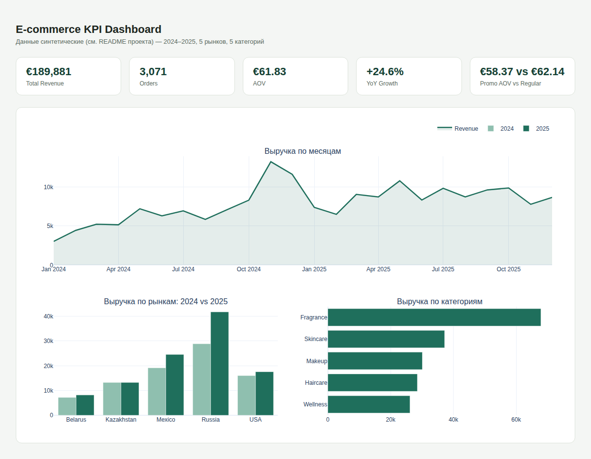

# SQL + интерактивный KPI-дашборд

SQL-слой поверх SQLite и интерактивный HTML-дашборд (Plotly) по выручке мультирыночного
e-commerce: динамика по месяцам, YoY по рынкам, разбивка по категориям, эффект промо.
Тот же датасет, что и в `02-ecommerce-rfm-cohort` (детали генерации — в его README), но
здесь под другим углом — не сегментация клиентов, а регулярная KPI-отчётность.



GitHub не рендерит HTML-файлы в просмотрщике репозитория — открой `dashboard.html`
локально в браузере (или включи GitHub Pages, см. ниже), чтобы увидеть его живым, со
всеми интерактивными подсказками при наведении.

## Что получилось

- Total Revenue: €189 881.11 за 2024–2025, 3 071 заказ, AOV €61.83
- YoY: с €84 524 до €105 357, +24.6%
- По категориям: Fragrance крупнейшая (35.7% выручки), дальше Skincare (19.6%), Makeup
  (15.9%), Haircare (15.0%), Wellness (13.8%)
- По рынкам: Россия — крупнейший рынок и с наибольшим приростом (€28.9K → €41.8K, +44.6%),
  Мексика на втором месте (+28.3%); Казахстан почти не вырос (+0.02%)
- Промо: средний чек в промо-периодах (€58.37) ниже, чем в обычные дни (€62.14), при
  среднем дисконте 6.9% против 1.3%. В этих данных промо не даёт прироста числа заказов
  сверх сезонного тренда, только снижает цену — по простому before/after сравнению эффект
  неоднозначный, нужен incrementality-тест с holdout-группой, чтобы отделить реальный
  прирост от каннибализации обычного спроса.

## Файлы

- `dashboard.html` — готовый дашборд, открывать в браузере
- `build_dashboard.py` — SQL-запросы → агрегаты → дашборд
- `sql/kpi_queries.sql` — те же запросы отдельным файлом
- `data/`, `exports/` — исходные данные и агрегаты

## Запуск

```
pip install pandas plotly
python3 build_dashboard.py
```

## Чтобы дашборд открывался прямо по ссылке (GitHub Pages)

1. В репозитории → Settings → Pages
2. Source: Deploy from a branch → Branch: `main`, папка `/ (root)` → Save
3. Через пару минут дашборд будет доступен по
   `https://mamasa1d.github.io/<название-репозитория>/03-sql-kpi-dashboard/dashboard.html`
